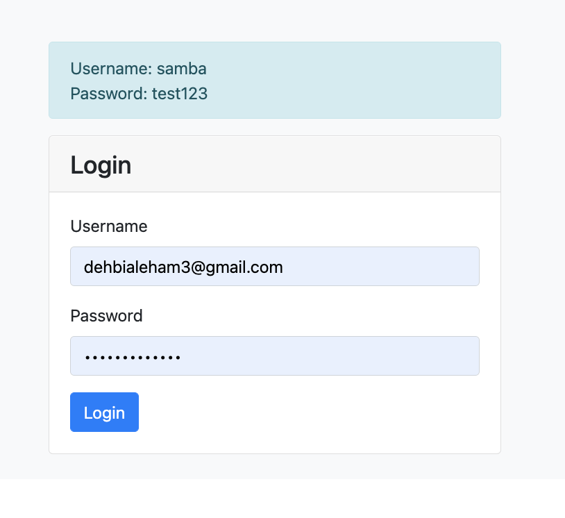
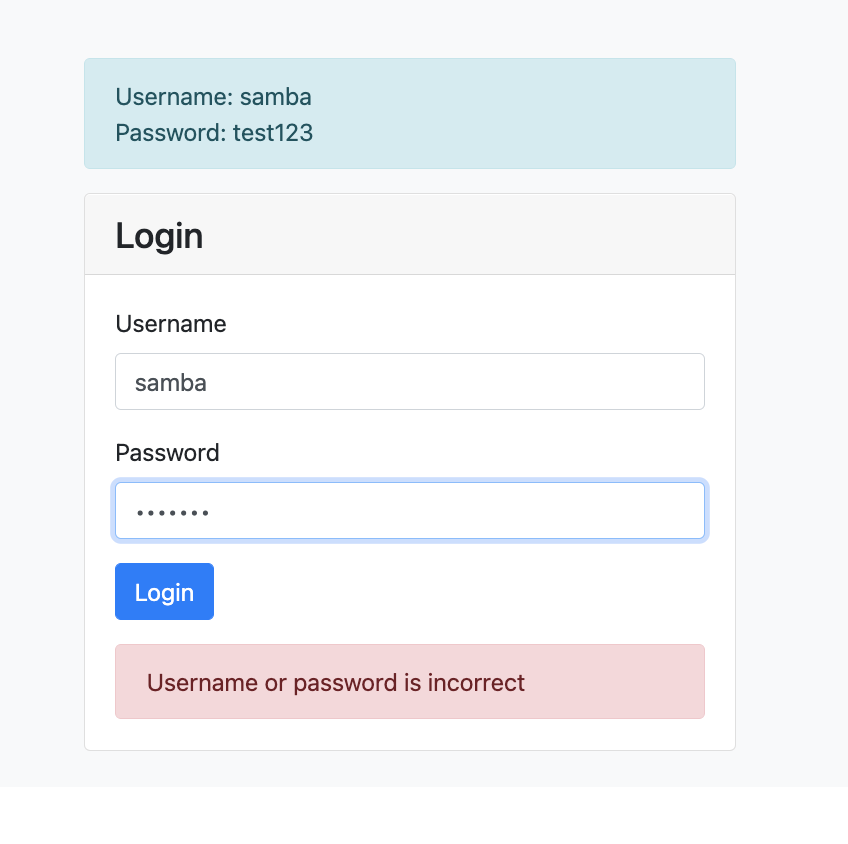
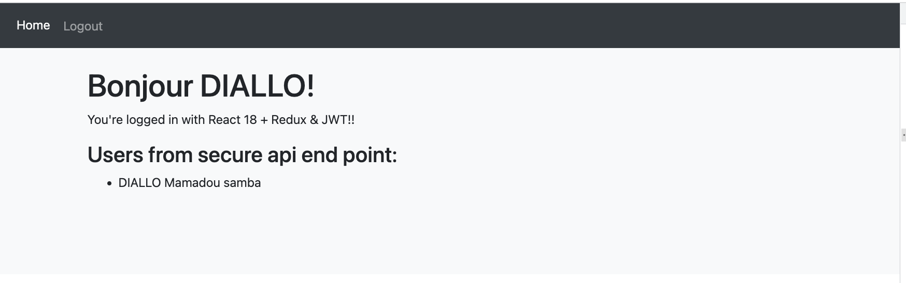

# React 18 + Redux - JWT Authentication Example

In this App we shows how to build a simple login application with React 18, Redux and the Redux Toolkit that uses JWT authentication.

# Redux State Management with Redux Toolkit

Redux State Management with Redux Toolkit
Redux is a state management library for managing global state in a React application. The Redux Toolkit was created to simplify working with Redux and reduce the amount of boilerplate code required.

State and business logic are defined in Redux using a centralized store. With the Redux Toolkit a store is made up of one or more slices, each slice manages the state for a section of the store. State is updated in Redux with actions and reducers, when an action is dispatched the Redux store executes a corresponding reducer function to update the state. Reducers cannot be called directly, they are called by Redux as the result of an action.

# `screenShot`

